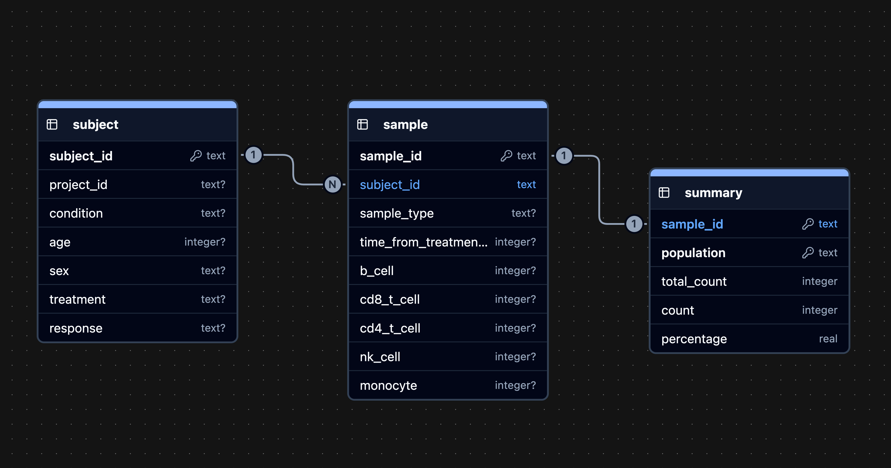

# Teiko Immune Cell Analysis

This project implements a small analysis pipeline and interactive dashboard for exploring immune cell population data from a clinical trial, with a focus on understanding treatment response. Raw cell count data are stored in a SQLite database, transformed into derived summary tables for analysis, and exposed through a Streamlit dashboard for interactive exploration.


## Quick Start (GitHub Codespaces)

```bash
# Create and activate conda environment
conda env create -f environment.yml
conda activate teiko

# Initialize database (if immune.db not already created)
python -m src.database

# Run the dashboard
streamlit run app.py
```

Codespaces should detect the port and prompt you to open the dashboard in browser.

## Database Schema




The relational schema is designed to separate clinical metadata from experimental measurements in a manner that is simple enough for analytical workflows. The `subject` table stores patient-level demographic and clinical attributes which are independent of samples, such as condition, treatment, and response to treatment. The `sample` table represents individual biological samples collected from subjects and stores raw experimental measurements, such as immune cell counts, along with sample type and time from treatment start, enabling temporal and subset-based analyses. A derived `summary` table stores precomputed total counts and relative frequencies for each immune cell population per sample, which simplifies downstream analytics and visualization without repeatedly recomputing these values at query time.

This design scales cleanly to larger studies: patient metadata is stored once per subject, while sample-level data grows linearly with experimental throughput. Indexes on cohort-defining fields (condition, treatment, response), sample type, and timepoint support efficient filtering, and the summary table acts as a lightweight analytics layer for the dashboard. If data size or analytical needs continued to grow, the schema could be migrated to a larger relational database or extended with additional summary tables without changing the core design.


### Tables

`subject` - Clinical/demographic data per patient
| Column | Type | Description |
|--------|------|-------------|
| subject_id | TEXT (PK) | unique patient id |
| project_id | TEXT | clinical trial/project id |
| condition | TEXT | disease|
| age | INTEGER | patient age |
| sex | TEXT | M/F |
| treatment | TEXT | treatment administered |
| response | TEXT | treatment response (yes/no) |

`sample` - Cell counts per sample
| Column | Type | Description |
|--------|------|-------------|
| sample_id | TEXT (PK) | unique sample id |
| subject_id | TEXT (FK) | id of patient |
| sample_type | TEXT | sample type |
| time_from_treatment_start | INTEGER | days from treatment start |
| b_cell, cd8_t_cell, cd4_t_cell, nk_cell, monocyte | INTEGER | count of each cell type |

`summary` - Precomputed relative frequencies
| Column | Type | Description |
|--------|------|-------------|
| sample_id | TEXT (PK, FK) | id of sample |
| population | TEXT (PK) | cell type name |
| total_count | INTEGER | total cells in sample |
| count | INTEGER | num cells of this population |
| percentage | REAL | relative frequency (%) |


## Code Structure

```
teiko/
├── data/
│   └── cell-count.csv       # Raw input data
├── src/
│   ├── __init__.py
│   ├── database.py          # Schema definition, data loading
│   ├── queries.py           # Reusable SQL query functions
│   ├── analysis.py          # Statistical analysis
│   └── visualization.py     # Plotly chart generation
├── app.py                   # Streamlit dashboard
├── immune.db                # SQLite database
└── README.md
```

The codebase is structured to mirror the flow of the analysis rather than treating everything as part of the dashboard. The database schema and data loading live in `database.py` so the relational model and indexes are defined once and can be reused across analyses. SQL queries that define cohorts or subsets of the data are grouped in `queries.py`. Statistical testing is implemented in `analysis.py` so it can be run and validated independently of the dashboard, while `visualization.py` contains plotting functions. The Streamlit app (app.py) acts mainly as a coordinator, wiring together queries, analysis, and plots in response to user input. This separation makes it easier to iterate on the analysis and would allow pieces of the project to be extended or swapped out without reworking the entire codebase.

## Dashboard

Run `streamlit run app.py` in GitHub Codespaces to view the dashboard.

The dashboard provides:
- Summary table of cell population frequencies (Part 2)
- Boxplot comparison of responders vs non-responders (Part 3)
- Statistical significance results with Mann-Whitney U test (Part 3)
- Baseline sample counts by project, response, and sex (Part 4)
